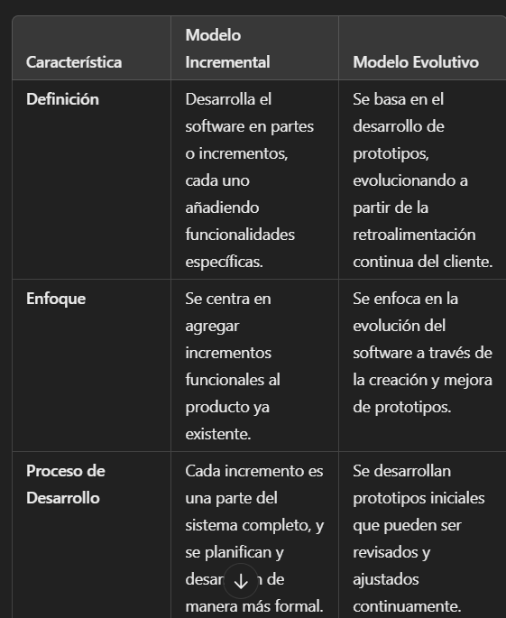

El **flujo lineal** en el desarrollo de software es un enfoque secuencial que sigue una serie de etapas claramente definidas y ordenadas. Se puede resumir en los siguientes pasos:

El **flujo iterativo** en el desarrollo de software es un proceso **cíclico** que se enfoca en crear y mejorar el software de manera continua a través de varias fases.

Características del **flujo paralelo**:

Multitarea: Varias tareas se llevan a cabo al mismo tiempo, lo que permite un uso más eficiente del tiempo y los recursos.

El **flujo evolutivo** en el desarrollo de software se refiere a cómo un sistema de software cambia y mejora a lo largo del tiempo. 

# Modelo en Cascada de Desarrollo de Software

El **modelo en cascada** es un enfoque secuencial y **lineal** para el desarrollo de software, adecuado para proyectos con requisitos bien definidos.

## Fases

1. **Requisitos**: Recopilación y documentación de los requisitos del software.
2. **Diseño**: Elaboración del diseño arquitectónico y detallado.
3. **Implementación**: **Codificación** del software.
4. **Pruebas**: Verificación del cumplimiento de los requisitos mediante pruebas.
5. **Despliegue**: Entrega e instalación en el entorno de producción.
6. **Mantenimiento**: Correcciones y ajustes post-entrega.

## Ventajas

- Claridad en el proceso.
- Documentación completa.
- Facilita la gestión de proyectos.

## Desventajas

- Rigidez ante cambios.
- Descubrimiento tardío de errores.
- No apto para proyectos complejos o innovadores.

# Modelo en V de Desarrollo de Software

El **modelo en V** es una **extensión del modelo en cascada que enfatiza la verificación y validación en cada fase del desarrollo.** Se representa en forma de "V" para mostrar la relación entre las fases de desarrollo y sus respectivas fases de prueba.

## Fases del Modelo en V

1. **Análisis de Requisitos**:
   

2. **Especificación de Requisitos del Sistema**:

3. **Diseño de Arquitectura del Sistema**:
   

4. **Diseño de Módulos o Componentes**:
   

5. **Implementación y Codificación**:
   

### Fases de Pruebas (Simétricas al Desarrollo)

6. **Pruebas Unitarias**:
   - Verificación del funcionamiento de cada módulo o componente individual.

7. **Pruebas de Integración**:
   - Validación de la interacción y la comunicación entre módulos y componentes.

8. **Pruebas de Sistema**:
   - Evaluación del sistema completo para asegurar que funcione como un todo coherente.

9. **Pruebas de Aceptación**:
   - Validación final para asegurar que el sistema cumple con los requisitos del usuario.

## Características

- **Enfoque en Verificación y Validación**: Cada fase de desarrollo tiene una fase de prueba correspondiente.
- **Proceso Lineal y Estructurado**: Sigue un orden secuencial y organizado, similar al modelo en cascada.

## Ventajas

- Claridad en las fases de desarrollo y pruebas.
- **Detección temprana de errores gracias a la validación continua.**
- Estructura bien definida que facilita la gestión de proyectos.

## Desventajas

- Poco flexible para adaptarse a cambios en los requisitos.
- Requiere una definición precisa de los requisitos desde el principio.
- Puede ser costoso y lento en proyectos donde los cambios son frecuentes.

# Modelo de Procesos Incrementales de Desarrollo de Software

El **modelo incremental** es un enfoque que desarrolla el software en pequeñas partes o incrementos, permitiendo la entrega y mejora continua del producto.

## Fases

1. **Planificación**: Definición de los requisitos y priorización de funciones para cada incremento.
2. **Análisis y Diseño**: Diseño de cada incremento basado en los requisitos establecidos.
3. **Implementación**: Desarrollo del incremento y codificación del software.
4. **Pruebas**: Verificación y validación del incremento desarrollado.
5. **Despliegue**: Entrega del incremento al cliente y feedback.
6. **Repetición**: Repetición del proceso para el siguiente incremento, incorporando el feedback recibido.

## Ventajas

- Flexibilidad para adaptarse a cambios en los requisitos.
- Entrega continua y mejora del software.
- Mayor involucramiento del cliente a lo largo del desarrollo.

## Desventajas

- Gestión de integración compleja entre incrementos.
- **Necesidad de una planificación constante.**
- Posibles problemas de documentación y coherencia entre incrementos.

# Modelo de Procesos Evolutivos de Desarrollo de Software

El **modelo evolutivo** es un enfoque que permite el desarrollo de software mediante una serie de versiones sucesivas, evolucionando a partir de prototipos iniciales y adaptándose a los cambios de requisitos a lo largo del tiempo.

## Fases

1. **Prototipo Inicial**: Creación de un prototipo básico para explorar y entender los requisitos.
2. **Revisión y Feedback**: Evaluación del prototipo por parte de los usuarios y recolección de feedback.
3. **Desarrollo de Versiones**: Implementación de mejoras y nuevas funciones en base al feedback recibido.
4. **Pruebas**: Verificación y validación de cada versión.
5. **Despliegue**: Entrega de versiones sucesivas al cliente.
6. **Mantenimiento y Evolución**: Realización de ajustes y adiciones basadas en el uso y la retroalimentación continua.

## Ventajas

- Flexibilidad para adaptarse a cambios en los requisitos.
- Mayor satisfacción del cliente debido a la involucración continua.
- Mejor comprensión de los requisitos a través de prototipos y feedback.

## Desventajas

- **Riesgo de alcance no definido, lo que puede llevar a proyectos descontrolados**
- Requiere una buena gestión de versiones y cambios.
- **Puede ser costoso en términos de tiempo y recursos si no se gestiona adecuadamente.**

# Proceso Unificado de Desarrollo de Software

El **Proceso Unificado (PU)** es un **enfoque iterativo e incremental** para el desarrollo de software que se basa en la utilización de modelos visuales y en la gestión de riesgos. Es conocido por su **flexibilidad y su énfasis en la colaboración entre el equipo de desarrollo y los interesados.**

## Fases

El Proceso Unificado se divide en cuatro fases principales:

1. **Inicio**:
   - Definición del alcance del proyecto y análisis de viabilidad.
   - Identificación de requisitos iniciales y elaboración de un modelo de caso de uso.
   - Evaluación de riesgos y planificación del proyecto.

2. **Elaboración**:
   - Desarrollo de una arquitectura robusta y diseño detallado del sistema.
   - Refinamiento de requisitos y establecimiento de un plan de proyecto más detallado.
   - Implementación de prototipos y pruebas iniciales.

3. **Construcción**:
   - Desarrollo iterativo del software con entregas incrementales.
   - Integración y validación continua del sistema.
   - Pruebas del sistema para asegurar que cumpla con los requisitos.

4. **Transición**:
   - Despliegue del software en el entorno de producción.
   - Formación de usuarios y soporte técnico.
   - Recopilación de feedback y realización de mejoras.

## Características

- **Iterativo e Incremental**: Se desarrollan versiones del software en ciclos cortos, lo que permite incorporar cambios basados en la retroalimentación del cliente.
- **Enfoque en Riesgos**: Se identifican y gestionan los riesgos desde las primeras fases del desarrollo.
- **Modelo Basado en Casos de Uso**: Los requisitos se definen a través de casos de uso, facilitando la comunicación entre los interesados y el equipo técnico.

## Ventajas

- Flexibilidad para adaptarse a cambios en los requisitos.
- Mejora continua a través de iteraciones y retroalimentación.
- Enfoque claro en la calidad del software y en la gestión de riesgos.

## Desventajas

- Puede ser complejo de implementar debido a su estructura iterativa.
- Requiere un compromiso significativo en la gestión del proyecto y la documentación.