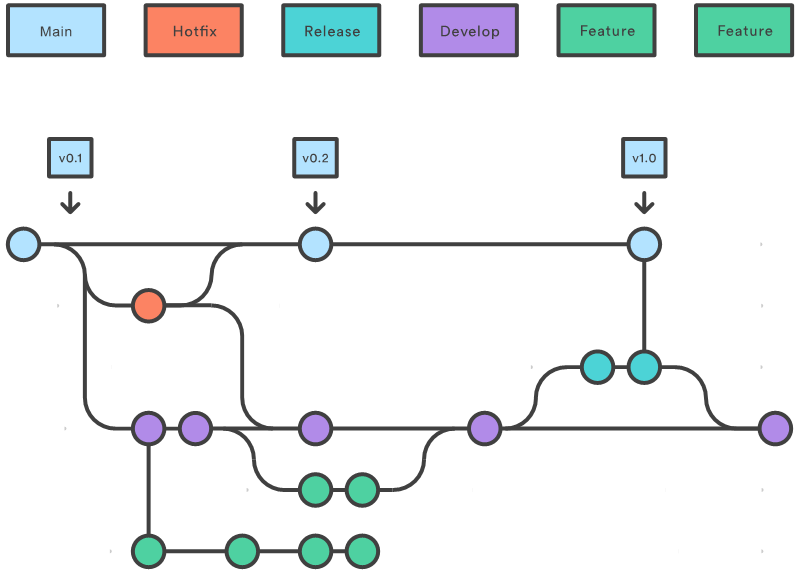

### Git es un sistema de control de versiones distribuido gratuito y de código abierto diseñado para manejar todo, desde proyectos pequeños hasta proyectos muy grandes con velocidad y eficiencia.

### Los Commits son las unidades centrales de la línea de tiempo de un proyecto. 

### Los Commits pueden considerarse instantáneas o hitos a lo largo de la línea de tiempo de un proyecto Git.

### Los Commits se crean con  git commit comando para capturar el estado de un proyecto en ese momento.

### Los Commits de Git siempre se envían al repositorio local.

### Las ramas en GIT son una división del estado del código, esto permite crear nuevos caminos a favor de la evolución del código. 

#### **Repositorio local**: Este repositorio es el que está en nuestra máquina local, y es sobre el cual haremos la mayor cantidad de operaciones. Además de que es el que siempre deberá existir de forma obligatoria, ya que puedo tener un repositorio Git solamente en mi PC sin uno remoto (por ende nunca podré compartir el código asociado).

#### **Repositorio remoto**: Este repositorio es el que está en el servidor, permitiendo sincronizar los cambios de los distintos repositorios locales asociados al mismo.

>Hacer commits de forma periódica cuando tengamos una unidad lógica terminada (es algo que deberíamos hacer siempre, independientemente de la plataforma de versionado que utilicemos).

>Trabajar con ramas para separar las distintas features o funcionalidades que desarrollemos.

>Considerar que todo lo que hacemos en nuestro repositorio (excepto push y pull) es 100% local. Eso nos da flexibilidad para hacer determinadas acciones sin consecuencias.

