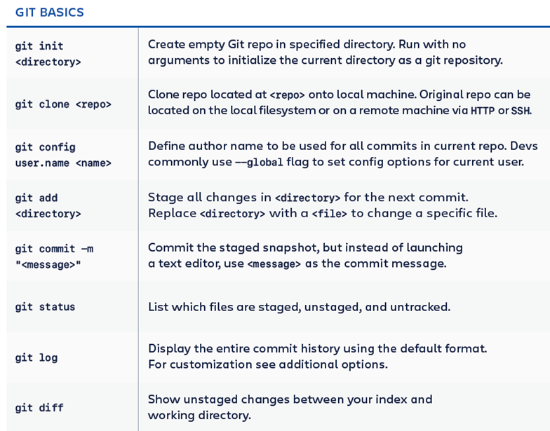
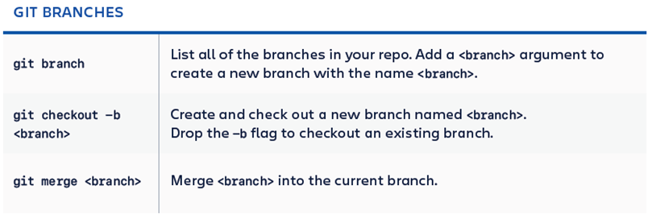

### Dile a Git quién eres

 - git config --global user.name “pablo.herrero"

- git config --global user.email “pablo.Herrero@uneatlantico.es"

-  git config --global --list # To check the info you just provided

### Otros comandos

- git init

- git clone urlrepo
- git add .
- git commit –m “message”
- git remote add <name> <url>

- git push

