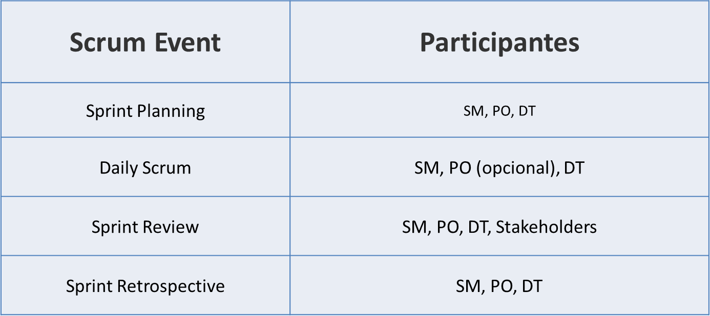
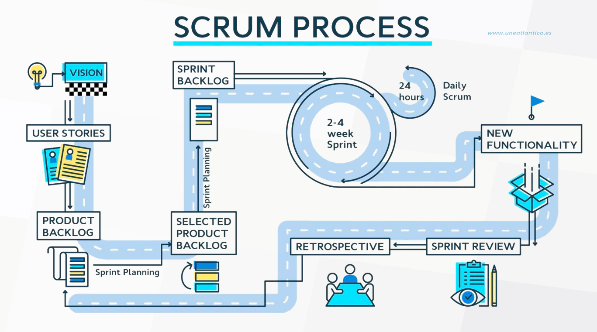

# SCRUM

### Las metodologías ágiles son un conjunto de enfoques de desarrollo de software que **se centran en la colaboración, la comunicación y la entrega rápida de valor al cliente**. 

### **Se basan en la idea de que los requisitos del software cambian con el tiempo**, y que es más eficiente adaptar el proceso de desarrollo a esos cambios que intentar predecirlos con precisión.

## Las metodologías ágiles se caracterizan por:

- #### **Desarrollo iterativo e incremental**: El software se desarrolla en ciclos cortos, llamados sprints, en los que se entrega una versión funcional del producto.

- #### **Participación del cliente**: El cliente está involucrado en el proceso de desarrollo desde el principio, para garantizar que el producto satisfaga sus necesidades.

- #### **Colaboración entre equipos**: Los equipos ágiles están formados por personas de diferentes disciplinas que trabajan juntas para desarrollar el producto.

- #### **Comunicación frecuente**: La comunicación es clave en los procesos ágiles. El equipo se reúne regularmente para discutir el progreso y abordar los problemas.

- #### **Adaptabilidad**: Las metodologías ágiles son flexibles y adaptables a los cambios

### Algunos de los beneficios de las metodologías ágiles incluyen:

- #### Mejor satisfacción del cliente: Los clientes están más involucrados en el proceso de desarrollo, lo que les permite obtener un producto que satisfaga sus necesidades.

- #### Mayor productividad: Los procesos ágiles ayudan a los equipos a trabajar de forma más eficiente y entregar el producto más rápido.

- #### Menor riesgo: Los cambios se pueden incorporar al proceso de desarrollo de manera más fácil y económica.

##### Las metodologías ágiles se han convertido en un enfoque popular para el desarrollo de software, y son utilizadas por empresas de todos los tamaños.

### **Scrum** es una metodología ágil de desarrollo de software que se basa en el **trabajo en equipo, la comunicación frecuente y la adaptabilidad a los cambios**

#### El proceso de Scrum se divide en ciclos cortos, llamados sprints, que suelen durar de dos a cuatro semanas. En cada sprint, el equipo se centra en completar un conjunto de tareas o historias de usuario.

## Principios

- Proceso empírico: transparencia, adaptación, inspección.
- Auto-organización
- Colaboración
- Priorización del valor
- Time boxing
- Desarrollo por iteraciones

## Conceptos clave

- ### **Épica**: Es una historia de usuario que es demasiado grande para caber en un sprint. A menudo, este término se utiliza para describir una gran historia de usuario que tendrá que ser dividida en historias más pequeñas.
- ### **Historia de usuario**: Es una representación de un requisito del usuario en forma escrita.
- ### **Tarea**: Es una representación del requisito que está en lenguaje del usuario, pero de una forma técnica donde está definido cómo se va a trabajar y quiénes van a participar.

- ### **Definición de Hecho (Definition of Done)**: Son los acuerdos del PO con los Stakeholders. Contiene el conjunto de reglas que se aplican a las historias de usuario en un sprint para considerarlo finalizado. 
- ### **Criterios de aceptación**: Son los componentes objetivos por los cuales se juzga la funcionalidad de una Historia de Usuario.
- ### **Objetivo del Sprint (Sprint Goal)**: Es una meta establecida para el Sprint que puede lograrse mediante la implementación del Product Backlog. 

## Roles

### Los principales roles en Scrum son:

- ### **El Product Owner**: es responsable de definir los requisitos del producto y priorizarlos.

- ### **El Scrum Master**: es responsable de facilitar el proceso de Scrum y ayudar al equipo a alcanzar sus objetivos.

- ### **El equipo de desarrollo**: es responsable de desarrollar el producto.

## Product Owner

### Características

- #### Dominio y conocimiento del negocio
- #### Excelentes habilidades de comunicación
- #### Habilidades de negociación
- #### Decisivo
- #### Proactivo

### Responsabilidades

- #### Representar al usuario o al cliente.
- #### Entender y apoyar las necesidades de los stakeholders.
- #### Definir los criterios de aceptación.
- #### Centrarse en la creación de valor.
- #### Administrar y priorizar el product backlog.
- #### Determinar las actividades generales de inicio de un proyecto.
- #### Establecer plazos de entrega del proyecto con el usuario.
- #### Garantizar la entrega del producto o servicio.

## Scrum  Master

### Características

- #### Líder al servicio del equipo
- #### Guardián del equipo
- #### Proactivo

### Responsabilidades

- #### Asegurar que los objetivos, el alcance y el dominio del producto sean entendidos por todo el equipo.
- #### Facilitar técnicas para gestionar el Product Backlog de manera eficiente.
- #### Guiar al equipo en ser auto-organizado y multifuncional.
- #### Eliminar impedimentos que se puedan presentar en el equipo.
- #### Cuidar la calidad del desarrollo del requerimiento.

# Eventos

### Los principales eventos en Scrum son:

- #### **El Sprint Planning**: en el que el equipo se reúne para planificar el sprint.

- #### **El Daily Scrum**: en el que el equipo se reúne diariamente para discutir el progreso y los problemas.

- #### **La Revisión del Sprint**: en la que el equipo presenta el producto al Product Owner y a otros interesados.

- #### **La Retrospectiva del Sprint**: en la que el equipo analiza su rendimiento y busca formas de mejorar.

## Sprint Planning

### Reunión que se realiza al comienzo de cada Sprint para inspeccionar el Product Backlog,  y que el equipo de desarrollo seleccione los requerimientos en los que va a trabajar durante el siguiente Sprint.

## Daily Scrum

### Reunión diaria para el DT. 

#### Optimiza la colaboración y el desempeño del equipo inspeccionando el trabajo avanzado desde el último Scrum Diario y haciendo una proyección del trabajo del Sprint a realizar a continuación.

#### Se realiza a la misma hora y en el mismo lugar todos los días para reducir la complejidad.

#### Algunos Equipos de Desarrollo usarán preguntas como:

- ¿Qué hice ayer? 
- ¿Qué haré hoy? 
- ¿Veo algún impedimento?

## Sprint Review

- #### Los asistentes son el Scrum Team y los Stakeholders.

- #### El PO explica qué elementos del Product Backlog se han “Terminado” y cuales no se han     “Terminado”

- #### El DT habla acerca de qué estuvo bien durante el Sprint, qué problemas aparecen y cómo fueron resueltos.

- #### El DT hace una demostración del trabajo que ha “Terminado” y responde preguntas acerca del Incremento.

- #### El PO habla acerca del Product Backlog en su estado actual. Proyecta objetivos y fechas de entrega basándose en el progreso obtenido.

- #### El grupo completo colabora acerca de qué hacer a continuación, de modo que el Sprint Review proporcione información de entrada valiosa para el siguiente Sprint Planning.

# Artefactos

### Los principales artefactos en Scrum son:

- #### **El Backlog del producto**: es una lista de todas las características y funcionalidades que se desea incluir en el producto.

- #### **El Backlog del sprint**: es una lista de las tareas que se deben completar en el sprint.

- #### **El Producto incremento**: es una versión funcional del producto que se entrega al final de cada sprint.

# Estimaciones

- #### Se basan en el esfuerzo requerido para completar una tarea.

- #### Valores numéricos de la serie de Fibonacci (1,1,2,3,5,8…) o bien valores de horas (1h,4h…), dependiendo el sistema que se use.

- #### Si una tarea es demasiado grande, y nadie tiene idea concreta de cómo abordarla se puede estimar como infinito, esto significa que la tarea se debe fragmentar más.

